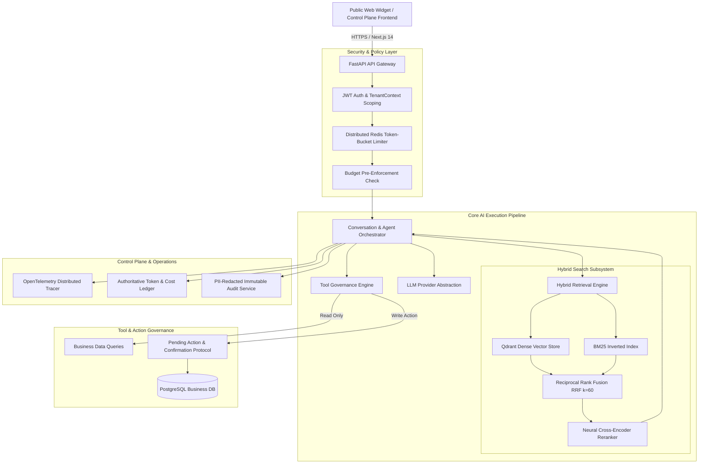

# AVTAAR — FINAL PRODUCTION ARCHITECTURE

## System Architecture & Component Boundaries

---

### Component Boundaries & Responsibilities

#### 1. API & Security Gateway (`app.api`)
- **FastAPI Async Framework**: Handles JSON API endpoints with structured Pydantic schemas.
- **Dependency Injection**: `get_tenant_context` extracts JWT bearer claims, validates company membership, and attaches tenant identifiers to the request lifecycle.
- **Distributed Rate Limiting**: Enforces tenant-level and IP-level burst limits using Redis sliding token buckets.

#### 2. RAG & Retrieval Subsystem (`app.services.rag` & `app.services.vector`)
- **Hybrid Retrieval**: Queries Qdrant dense vector embeddings (1536-d or 384-d) concurrently with BM25 sparse keyword indices.
- **Reciprocal Rank Fusion (RRF)**: Combines candidates using the standardized constant $k=60$.
- **Reranker Pipeline**: Cross-encoder reranking prioritizes chunks with verified lexical and contextual alignment, injecting citation source paths and page metadata.

#### 3. Agent Tool Runtime & Action Governance (`app.services.tools`)
- **Permission Matrix**: Differentiates `READ` actions (instant execution) from `WRITE` actions (`CREATE_TICKET`, `CREATE_LEAD`, `CREATE_ORDER`, etc.).
- **Two-Phase Commit**: Write actions generate a secure `PendingToolAction` with an expiry window. Execution requires an explicit user confirmation payload.

#### 4. Control Plane: Observability, Usage, & Budgets (`app.services.observability` & `app.services.billing`)
- **Distributed Tracing**: Records request trees with spans for `RETRIEVAL`, `RERANK`, `LLM_GENERATION`, and `TOOL_EXECUTION`.
- **Model Pricing Registry**: Authoritative pricing table for input, output, and cached tokens across OpenAI, Anthropic, and Gemini models.
- **Budget Enforcement**: Hard reject (`402/429`) when tenant spend limits are exhausted; soft warning flags when utilization exceeds configured thresholds.
