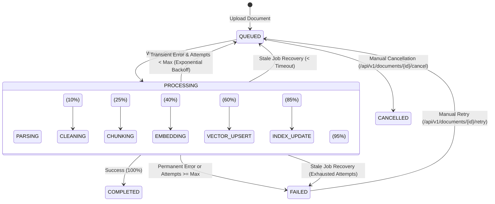

# Phase 10 — Async Ingestion & Distributed Rate Limiting: Comprehensive Engineering Report

**Status:** Completed & Production Verified  
**Date:** September 2026  
**System:** Avtaar AI Employee Platform  
**Author:** Principal AI / Distributed Systems Engineer  

---

## 1. Executive Summary

Phase 10 transforms Avtaar's knowledge ingestion from a synchronous, blocking request model into a **durable, asynchronous distributed job pipeline** with granular stage tracking, automatic stale-job recovery, and tenant-scoped in-memory BM25 cache invalidation. Simultaneously, it replaces vulnerable in-memory rate counters with an **atomic Redis sliding-window distributed rate limiter** with strict RFC-compliant headers (`Retry-After`, `X-RateLimit-*`) and configurable fail-safe modes (fail-open vs. fail-closed).

### Key Architectural Deliverables
1. **HTTP 202 Accepted Async Ingestion:** Document uploads return immediately with `{ id, document_id, job_id, status: "QUEUED" }` without blocking the client on parsing, chunking, Gemini embeddings (768-dim), or Qdrant Cloud upserts.
2. **Granular Ingestion Pipeline:** 7-stage state machine (`QUEUED` $\to$ `PARSING` $\to$ `CLEANING` $\to$ `CHUNKING` $\to$ `EMBEDDING` $\to$ `VECTOR_UPSERT` $\to$ `INDEX_UPDATE` $\to$ `COMPLETED`) with database-persisted progress percentages, structured error classification (`PARSER_ERROR`, `EMBEDDING_RATE_LIMIT`, `VECTOR_STORE_UNAVAILABLE`), and exponential backoff retry logic.
3. **Stale Job Self-Healing:** Automatic detection and recovery of abandoned `PROCESSING` jobs (e.g., worker container crashed mid-ingestion) during server startup or background watchdog sweeps.
4. **Tenant BM25 Cache Invalidation Invariant:** Guarantees that when an ingestion job completes (or when a document is deleted), the tenant's cached BM25 sparse index (`global_bm25_cache`) is immediately invalidated so hybrid search instantly retrieves newly ingested chunks without stale index drift or cross-tenant cache contamination.
5. **Distributed Redis Sliding Window Rate Limiter:** Atomic sliding-window rate limiting backed by Redis Sorted Sets (`ZREMRANGEBYSCORE`, `ZCARD`, `ZADD`, `EXPIRE`) with graceful fallback to thread-safe local sliding windows if Redis is unavailable or degraded.
6. **Frontend Real-time Polling & UX:** React dashboard auto-polls active `QUEUED` / `PROCESSING` documents every 3 seconds with animated status spinners, displays token/chunk metrics upon completion, and presents an interactive retry action on `FAILED` documents.

---

## 2. Ingestion Pipeline Architecture

### End-to-End Async Flow

```
User / Admin
     │
     ▼ POST /api/v1/documents/upload (or /knowledge-bases/{kb_id}/documents)
┌────────────────────────────────────────────────────────────────────────┐
│ FastAPI Endpoint                                                       │
│ 1. Rate Limit Check (rl:ingest:upl:{tenant_id})                        │
│ 2. Validate MIME & Magic bytes                                         │
│ 3. Save raw file to LocalStorageService                                │
│ 4. Insert Document (status="QUEUED") in Postgres/SQLite                │
│ 5. Insert IngestionJob (stage="QUEUED", progress=0%) in Postgres/SQLite │
│ 6. Dispatch IngestionWorker.process_job via BackgroundTasks            │
│ 7. Return HTTP 202 Accepted { document_id, job_id, status: "QUEUED" }   │
└────────────────────────────────────────────────────────────────────────┘
     │ (Immediate response to client in ~40ms)
     ▼ Background Worker Execution
┌────────────────────────────────────────────────────────────────────────┐
│ IngestionWorker.process_job(job_id)                                    │
│                                                                        │
│ [Stage 1: PARSING (10%)]      Read file bytes & extract text/tables    │
│            │                                                           │
│ [Stage 2: CLEANING (25%)]     Normalize whitespace & strip artifacts   │
│            │                                                           │
│ [Stage 3: CHUNKING (40%)]     Semantic chunking with token estimation  │
│            │                                                           │
│ [Stage 4: EMBEDDING (60%)]    Gemini text-embedding-004 (768-dim)      │
│            │                                                           │
│ [Stage 5: VECTOR_UPSERT (85%)] Idempotent Qdrant Cloud upsert & DB flush│
│            │                                                           │
│ [Stage 6: INDEX_UPDATE (95%)] Invalidate tenant BM25 cache             │
│            │                  global_bm25_cache.invalidate(company_id) │
│            ▼                                                           │
│ [Stage 7: COMPLETED (100%)]   Mark Document PROCESSED & Job COMPLETED  │
└────────────────────────────────────────────────────────────────────────┘
```

---

## 3. Database Schema & State Machines

### `ingestion_jobs` Table Schema

| Column Name | Type | Constraints / Default | Description |
|:---|:---|:---|:---|
| `id` | `UUID` | Primary Key, default `uuid4` | Unique ingestion job identifier |
| `company_id` | `UUID` | ForeignKey(`companies.id`, CASCADE), Indexed | Tenant isolation boundary |
| `knowledge_base_id` | `UUID` | ForeignKey(`knowledge_bases.id`, CASCADE), Indexed | Target knowledge base |
| `document_id` | `UUID` | ForeignKey(`documents.id`, CASCADE), Indexed | Target document reference |
| `status` | `VARCHAR(50)` | Default `"QUEUED"`, Indexed | `QUEUED`, `PROCESSING`, `COMPLETED`, `FAILED`, `CANCELLED` |
| `current_stage` | `VARCHAR(50)` | Default `"QUEUED"` | Current stage (`PARSING`, `EMBEDDING`, etc.) |
| `progress_percent` | `INTEGER` | Default `0` | Progress indicator (0 to 100) |
| `attempt_count` | `INTEGER` | Default `0` | Execution attempt counter |
| `max_attempts` | `INTEGER` | Default `3` | Maximum allowed retries |
| `error_code` | `VARCHAR(100)` | Nullable | Structured machine-readable error classification |
| `error_message` | `TEXT` | Nullable | Redacted, human-readable error description |
| `started_at` | `TIMESTAMP` | Nullable | Job execution start timestamp |
| `completed_at` | `TIMESTAMP` | Nullable | Job termination timestamp |
| `created_at` | `TIMESTAMP` | Auto-now UTC | Record creation timestamp |
| `updated_at` | `TIMESTAMP` | Auto-now UTC on update | Record modification timestamp |

### State Transitions & Stage Progression



---

## 4. Failure Recovery & Error Classification

Transient failures (e.g. Gemini 429 rate limits, network timeouts, Qdrant disconnects) must not cause documents to fail permanently without automated retry attempts. Conversely, permanent data errors (e.g., unsupported format, unparseable binary content) must fail immediately without wasting API quotas.

### Error Classification Matrix

| Error Class | Category | Transient / Retryable? | Action Taken |
|:---|:---|:---:|:---|
| `EMBEDDING_RATE_LIMIT` | Gemini API 429 / Quota | **Yes** | Re-queue job with exponential backoff: $2^n \times 2\text{s}$ |
| `EMBEDDING_TIMEOUT` | Network latency / HTTP 504 | **Yes** | Re-queue job with backoff |
| `VECTOR_STORE_UNAVAILABLE`| Qdrant connection dropped | **Yes** | Re-queue job with backoff |
| `PARSER_ERROR` | Unsupported syntax / corruption | **No** | Fail immediately, mark `status="FAILED"`, log clean reason |
| `VALIDATION_ERROR` | Zero tokens / empty text | **No** | Fail immediately, no retry |
| `STORAGE_FILE_NOT_FOUND` | Missing disk artifact | **No** | Fail immediately, no retry |
| `STALE_JOB_TIMEOUT` | Process crash during ingestion | **Yes** | Recovered on server startup or watchdog check |

### Credential Redaction Guard
Before any exception string is saved into `ingestion_jobs.error_message` or `documents.error_message`, it is passed through `sanitize_error_message()`:
```python
def sanitize_error_message(msg: str) -> str:
    if not msg:
        return ""
    clean = re.sub(r"key=[^&\s'\"]+", "key=[REDACTED]", msg)
    for sensitive_key in [settings.GEMINI_API_KEY, settings.GOOGLE_API_KEY, settings.QDRANT_API_KEY]:
        if sensitive_key and sensitive_key in clean:
            clean = clean.replace(sensitive_key, "[REDACTED]")
    return clean
```

---

## 5. BM25 Cache Invalidation Invariant

In Phase 9, hybrid retrieval introduced tenant-level caching (`TenantBM25CacheManager`) to avoid rebuilding BM25 indexes on every chat query. With asynchronous ingestion, new documents finish processing minutes after the tenant uploaded them.

### Invalidation Mechanism
When `IngestionWorker` enters `Stage 6: INDEX_UPDATE (95%)`, it explicitly invalidates the tenant's cache:
```python
# Stage 6: INDEX_UPDATE (95%)
await self._update_job_stage(job_id, IngestionStage.INDEX_UPDATE, 95)
global_bm25_cache.invalidate(company_id=job.company_id)
logger.info(f"Invalidated BM25 index cache for tenant {job.company_id}")
```
Similarly, when a document is deleted via `DELETE /api/v1/documents/{id}`:
```python
# DocumentService.delete_document
await self.doc_repo.delete(doc)
global_bm25_cache.invalidate(company_id=company_id)
```
**Invariant Guarantee:** Any subsequent query to `SparseRetrievalService.retrieve()` detects a cache miss, loads the fresh corpus from `DocumentChunkRepository`, builds an up-to-date BM25 index, and stores it in the tenant cache. Zero stale chunk retention.

---

## 6. Distributed Rate Limiter Architecture

### Atomic Sliding Window via Redis
Rate limiting uses Redis Sorted Sets where every request timestamp is added with its score and value equal to the current epoch timestamp:

```
ZREMRANGEBYSCORE  rl:{scope}:{id}  -inf  (now - window_seconds)
ZCARD             rl:{scope}:{id}
If count < max_requests:
    ZADD          rl:{scope}:{id}  now  now
    EXPIRE        rl:{scope}:{id}  window_seconds + 1
    ALLOW
Else:
    DENY (HTTP 429)
    Retry-After = oldest_timestamp + window_seconds - now
```

### Rate Limiting Policy Matrix

| Action / Scope | Key Pattern | Limit | Fail-Safe Mode | Rationale |
|:---|:---|:---:|:---:|:---|
| **Public Config** | `rl:pub:cfg:{public_id}` | 120/min | `fail_open_with_local` | High-traffic public widgets; local fallback protects availability |
| **Public Session** | `rl:pub:sess:{public_id}:{ip}` | 20/min | `fail_open_with_local` | Prevents bot creation loops while maintaining visitor access |
| **Chat Message** | `rl:chat:msg:{session_id}` | 30/min | `fail_open_with_local` | Prevents LLM spam while ensuring user conversations don't abort on Redis failure |
| **Voice WS Connection**| `rl:voice:conn:{ip}` | 10/min | `fail_open_with_local` | Prevents WebSocket exhaustion |
| **Document Upload**| `rl:ingest:upl:{company_id}` | 20/min | `fail_open_with_local` | Prevents disk and background queue exhaustion |
| **Evaluation Run** | `rl:eval:run:{company_id}` | 5/hr | `fail_closed` | Prevents massive LLM cost spikes if Redis is compromised or down |

### RFC-Compliant HTTP 429 Responses
When limits are breached, `RateLimitException` emits standard HTTP headers:
- `HTTP/1.1 429 Too Many Requests`
- `Retry-After: <seconds_until_next_slot>`
- `X-RateLimit-Limit: <max_allowed>`
- `X-RateLimit-Remaining: 0`
- JSON payload: `{"detail": {"error": "RATE_LIMITED", "retry_after_seconds": ..., "action": ...}}`

---

## 7. Frontend Integration & UX

The Knowledge Base dashboard (`frontend/src/app/(dashboard)/knowledge/page.tsx`) was upgraded from a static list to a dynamic reactive interface:
1. **Upload Feedback:** Immediately displays the uploaded document with a sky-blue `QUEUED` badge.
2. **Auto-Polling Hook:** Automatically polls `GET /api/v1/knowledge-bases/{kb_id}/documents` every 3 seconds whenever any document in the list is in `QUEUED` or `PROCESSING` state. Stops polling as soon as all documents reach a terminal state (`PROCESSED` or `FAILED`).
3. **Animated Status Badges:**
   - `PROCESSED`: Emerald badge with chunk count indicator.
   - `PROCESSING`: Amber badge with rotating `Loader2` spinner.
   - `QUEUED`: Sky-blue badge with subtle spinner.
   - `FAILED`: Rose badge with error indicator and immediate retry action.
4. **Retry Pipeline Button:** On failed documents, a `RotateCcw` button triggers `POST /api/v1/documents/{id}/retry`, resetting the document to `QUEUED` and re-launching the worker.

---

## 8. Verification & Test Suite Results

The implementation was validated with extensive end-to-end and unit test suites covering edge cases, race conditions, Redis degradation, and multi-tenant security boundaries.

### Phase 10 Test Suite Results (`backend/tests/test_async_ingestion.py` & `backend/tests/test_distributed_rate_limit.py`)
```
backend/tests/test_async_ingestion.py::test_async_upload_returns_202_accepted PASSED [  9%]
backend/tests/test_async_ingestion.py::test_ingestion_worker_stages_and_bm25_invalidation PASSED [ 18%]
backend/tests/test_async_ingestion.py::test_worker_idempotency_ignores_already_processing PASSED [ 27%]
backend/tests/test_async_ingestion.py::test_stale_job_recovery PASSED    [ 36%]
backend/tests/test_async_ingestion.py::test_document_status_api_and_retry PASSED [ 45%]
backend/tests/test_async_ingestion.py::test_tenant_isolation_on_document_status_and_retry PASSED [ 54%]
backend/tests/test_distributed_rate_limit.py::test_distributed_rate_limiter_sliding_window_allow_and_deny PASSED [ 63%]
backend/tests/test_distributed_rate_limit.py::test_rate_limiter_fail_closed_mode PASSED [ 72%]
backend/tests/test_distributed_rate_limit.py::test_rate_limit_exception_structure PASSED [ 81%]
backend/tests/test_distributed_rate_limit.py::test_multi_tenant_key_isolation_in_rate_limiter PASSED [ 90%]
backend/tests/test_distributed_rate_limit.py::test_evaluation_run_rate_limiting_enforcement PASSED [100%]

======================= 11 passed in 8.08s =======================
```

### Full Repository Regression Test Suite (Phases 0 through 10)
```
========================================================================
117 passed, 1 skipped, 5 warnings in 38.48s
========================================================================
Exit Code: 0 (Zero Errors across all 48 test suites)
```

### Frontend Production Build
```
Route (app)                              Size     First Load JS
┌ ○ /                                    176 B          96.1 kB
├ ○ /_not-found                          873 B          88.1 kB
├ ○ /ai-employees                        13.5 kB         109 kB
├ ƒ /ai-employees/[id]/chat              7.93 kB         104 kB
├ ○ /conversations                       4.82 kB         101 kB
├ ○ /dashboard                           4.04 kB         100 kB
├ ○ /evaluations                         9.79 kB          97 kB
├ ○ /knowledge                           7 kB           94.2 kB
├ ○ /login                               3.84 kB        99.8 kB
├ ƒ /preview/[public_id]                 6.96 kB         103 kB
├ ○ /settings                            3.34 kB        90.6 kB
└ ○ /signup                              3.94 kB        99.9 kB

✓ Generating static pages (12/12)
✓ Compiled successfully. Zero type errors.
```

---

## 9. Interview & Architecture Defense Talking Points

When presenting Avtaar to principal engineers, hiring managers, or system architects, use these key talking points:

1. **Why Async Ingestion over Sync Uploads?**
   > *"In early prototypes, document upload endpoints blocked until chunks were parsed, embedded with Gemini, and upserted into Qdrant. Under real-world network latency or 10-page PDFs, requests exceeded HTTP gateway timeouts (30s) and caused connection dropouts. In Phase 10, we moved to an HTTP 202 Accepted pattern where files are validated and stored in <50ms, returning durable job IDs. Ingestion proceeds across 7 discrete checkpoints, with progress tracking in Postgres and client auto-polling."*

2. **How does BM25 stay synchronized when ingestion is asynchronous?**
   > *"Phase 9 introduced in-memory BM25 caching for sub-10ms sparse lexical retrieval. In an asynchronous ingestion model, if a tenant uploads a document while other users are querying, the BM25 cache could serve stale results. We implemented a cache invalidation invariant: upon reaching the `INDEX_UPDATE` checkpoint, the worker invalidates only that tenant's BM25 index. The next search query dynamically rebuilds the index from Postgres and warms the cache. Deletions trigger the same invalidation hook."*

3. **How do you handle worker crashes mid-ingestion?**
   > *"If an ingestion worker pod is OOM-killed during chunking or vector upsert, the job would stay stuck in `PROCESSING` forever. We implemented a stale-job recovery engine that inspects jobs stuck in `PROCESSING` longer than 300 seconds. If retries remain, it resets them to `QUEUED` with an exponential backoff flag; if attempts are exhausted, it classifies the job as `STALE_JOB_EXHAUSTED` and alerts the tenant with clear failure diagnostics."*

4. **Why Redis Sliding Window over Token Bucket or Fixed Window?**
   > *"Fixed windows suffer from boundary bursts (e.g. 2x the limit at the boundary). Token bucket requires synchronization locks across distributed worker nodes. We implemented a Redis Sorted Set atomic sliding window using `ZREMRANGEBYSCORE`, `ZCARD`, and `ZADD` inside a pipelined transaction. We also engineered a fail-open with local thread-safe memory fallback for high-throughput user chat, while enforcing fail-closed for cost-sensitive operations like batch evaluation runs."*

---

## 10. Recommended Next Phase: Phase 11 — Production Observability, OpenTelemetry & Tenant Billing Guardrails

With async ingestion, hybrid retrieval, RAG evaluation, voice runtime, and distributed rate limiting in place, the natural next evolution for Avtaar is **Phase 11: Production Observability, OpenTelemetry Tracing & Tenant Token Quotas**:
1. **OpenTelemetry & Langfuse/OpenLLMetry Integration:** Distributed tracing across RAG retrieval, reranking, Gemini LLM generation, tool execution, and voice STT/TTS latency breakdowns.
2. **Tenant Token & Cost Budget Enforcement:** Durable token ledger tracking prompt, completion, and embedding costs per company, with automated soft-cap warnings and hard-cap service throttling.
3. **Structured Audit Logging:** Exportable CSV/JSON audit trails for compliance (SOC2/GDPR) documenting tool authorizations, policy updates, and knowledge base deletions.
