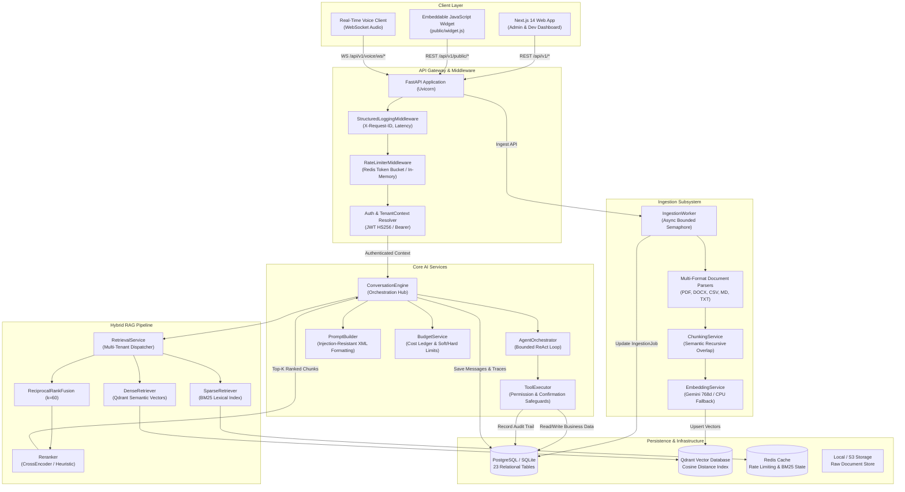
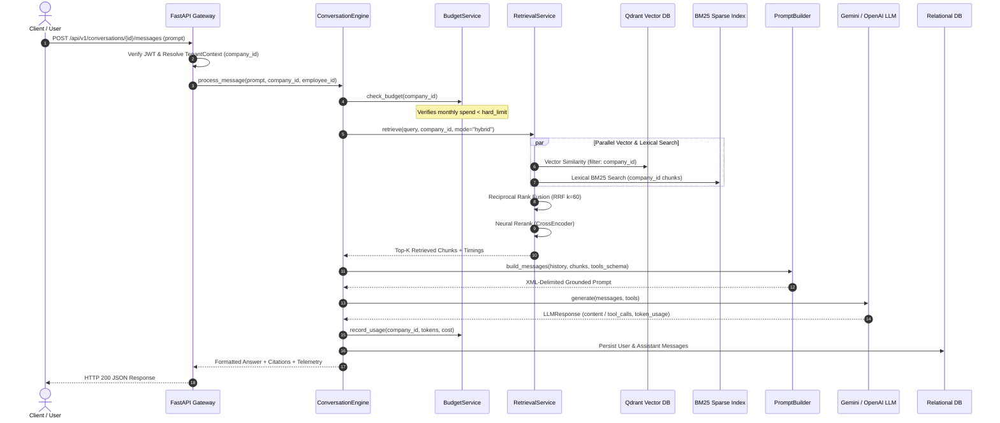
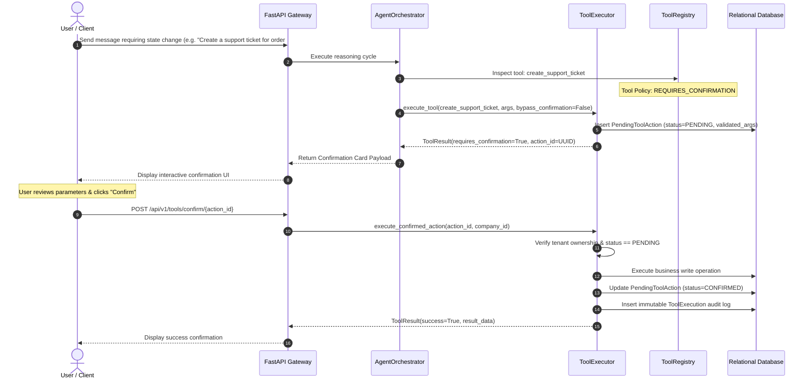
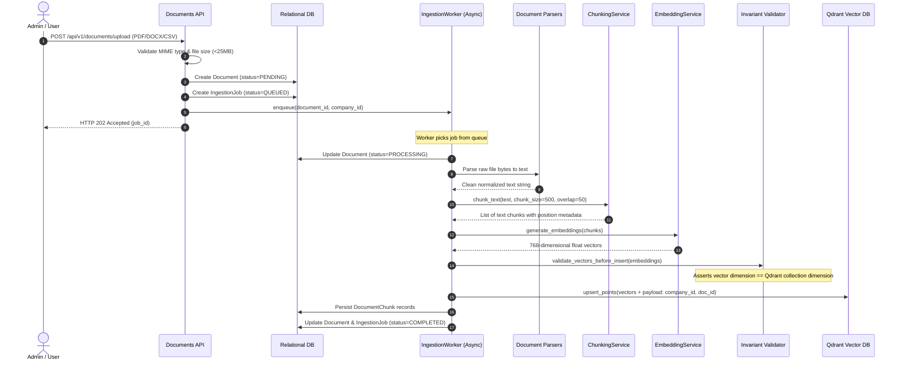
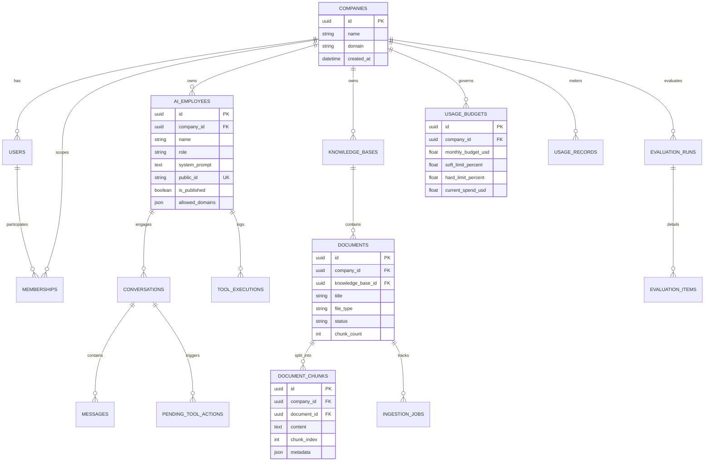

# 03 — Architecture and Data Flow

## 1. System Architecture Overview

**Avtaar** is structured around a decoupled, service-oriented architecture comprising four primary layers:
1. **Client / Presentation Layer:** Next.js 14 App Router dashboard, Embeddable Vanilla JS Widget (`widget.js`), and WebSocket Voice/Avatar client.
2. **API & Security Gateway Layer:** FastAPI application running on Uvicorn with structured JSON logging, token-based rate limiting, JWT authentication, and tenant context resolution.
3. **Core AI Engine & Execution Layer:** `ConversationEngine`, `AgentOrchestrator`, `ToolExecutor`, `PromptBuilder`, and `BudgetService`.
4. **Data & Storage Persistence Layer:** PostgreSQL / SQLite (via Async SQLAlchemy ORM), Qdrant Vector Database, and Redis Distributed Cache.

---

## 2. Platform Architecture Diagram

---

## 3. Detailed Component Interactions & Data Flows

### A. End-to-End Chat & RAG Retrieval Flow

---

### B. Tool Execution & Human Confirmation Flow

---

### C. Async Document Ingestion Pipeline

---

## 4. Database Schema & Multi-Tenant Relational Model

The relational schema comprises **23 tables** managed by Alembic migrations:

---

## 5. Architectural Quality Attributes & Design Principles

1. **Defense in Depth:** Tenant isolation is enforced at HTTP gateway, repository query construction, vector database filtering, and in-memory caching.
2. **Fail-Fast Invariants:** Incompatible vector dimensions, missing provider keys, or corrupt configurations raise immediate, clear runtime exceptions rather than silently degrading.
3. **Pluggable Architecture:** Embedding providers, LLM providers, storage backends, and rerankers implement strict abstract base classes (`EmbeddingProvider`, `LLMProvider`, `StorageService`, `Reranker`), allowing seamless swapping between Google Gemini, OpenAI, CPU mock engines, and cloud storage providers.
