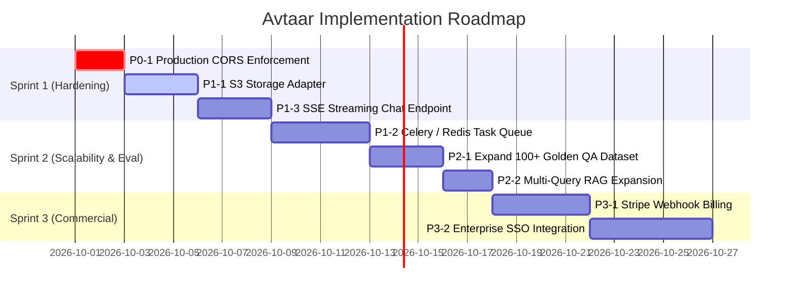

# 07 — Prioritized Improvement Roadmap

This document outlines a structured, prioritized engineering roadmap to transition **Avtaar** from a production-grade MVP into an enterprise-hardened, commercial B2B platform.

---

## 1. Prioritization Framework

- **P0 (Critical / Blockers):** Security vulnerabilities, cross-origin leaks, or catastrophic failure modes.
- **P1 (High Priority):** Core AI reliability, distributed scalability, and major interview credibility drivers.
- **P2 (Medium Priority):** Observability enhancements, advanced evaluation benchmarks, and UI/UX polish.
- **P3 (Optional / Future Enhancements):** Advanced multimodal capabilities and commercial billing automations.

---

## 2. Priority Findings & Action Items

### P0 — Critical Security & Correctness

#### Task P0-1: Restrict Production CORS Configuration
- **Finding:** `app/main.py` uses permissive regex matching (`r"^https?:\/\/.*$"`) allowing any origin in development.
- **Why It Matters:** Production deployment must strictly enforce whitelisted origins to prevent unauthorized cross-origin API abuse.
- **Action:** Update CORS middleware to strictly enforce `settings.BACKEND_CORS_ORIGINS` when `ENVIRONMENT=production`.
- **Complexity:** Low (1 hour).
- **Verification:** Unit test sending requests from unlisted Origin header returns HTTP 403 / unallowed CORS headers.

---

### P1 — High Priority: Reliability & Scalability

#### Task P1-1: Cloud Object Storage Adapter (AWS S3 / Google Cloud Storage)
- **Finding:** Document uploads currently persist to local disk storage (`app/services/storage.py:LocalStorageService`).
- **Why It Matters:** Multi-container Kubernetes / Cloud Run deployments cannot share local disk storage across stateless backend pods.
- **Action:** Implement `S3StorageService` using `boto3` / `aioboto3` adhering to the abstract `StorageService` interface.
- **Complexity:** Medium (1 day).
- **Verification:** Uploading documents when `STORAGE_BACKEND=s3` saves and streams directly from AWS S3 buckets.

#### Task P1-2: Distributed Task Queue for Document Ingestion
- **Finding:** `IngestionWorker` currently runs as an in-process background task within the FastAPI process.
- **Why It Matters:** Heavy document ingestion (e.g. 100-page PDF parsing and embedding generation) consumes backend CPU and memory, risking worker timeouts.
- **Action:** Decouple ingestion into an asynchronous Celery / Redis or Temporal task queue with dedicated worker containers.
- **Complexity:** Medium (2 days).
- **Verification:** Dispatching 50 concurrent document uploads queues tasks in Redis and executes asynchronously across worker nodes.

#### Task P1-3: Streaming SSE for Web Chat
- **Finding:** Dashboard chat currently waits for the full LLM completion before returning the entire message.
- **Why It Matters:** Streaming responses token-by-token (Server-Sent Events) reduces Time-To-First-Token (TTFT) perceived latency from 3–5 seconds to $<500\text{ms}$.
- **Action:** Implement an SSE streaming endpoint `/api/v1/conversations/{id}/stream` in FastAPI and update frontend chat hook.
- **Complexity:** Medium (1–2 days).
- **Verification:** UI renders words incrementally as they are generated by Gemini / OpenAI.

---

### P2 — Medium Priority: AI Quality & Governance Polish

#### Task P2-1: Expand Golden QA Evaluation Dataset
- **Finding:** Golden test suite contains ~20-30 baseline QA pairs.
- **Why It Matters:** A representative benchmark requires 100+ domain-specific test questions covering adversarial prompt injection, multi-hop RAG queries, and negative out-of-domain refusals.
- **Action:** Add structured JSON test sets for diverse enterprise domains (HR policies, technical API docs, support FAQs).
- **Complexity:** Medium (1 day).
- **Verification:** `python run_evaluation.py` executes 100+ cases and produces automated regression report.

#### Task P2-2: Multi-Query RAG Expansion
- **Finding:** User queries are currently passed directly to vector and BM25 retrievers without expansion.
- **Why It Matters:** Users often type vague or incomplete queries. Generating 3 alternative search queries boosts Recall@K significantly.
- **Action:** Add a lightweight query rewriter step in `RetrievalService` that generates 3 sub-queries and aggregates chunks via RRF.
- **Complexity:** Medium (1 day).
- **Verification:** Evaluated Recall@10 increases on complex, synonym-heavy benchmark queries.

---

### P3 — Optional: Commercial B2B Enhancements

#### Task P3-1: Stripe Billing & Credit Auto-Refill
- **Action:** Integrate Stripe webhook listeners to automatically update company token balance upon successful invoice payment.

#### Task P3-2: Enterprise SSO (SAML / OIDC / Okta)
- **Action:** Add WorkOS or Auth0 SAML connector for enterprise single sign-on.

---

## 3. Sprint Execution Roadmap

