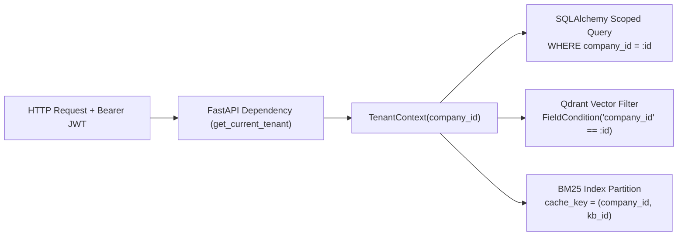
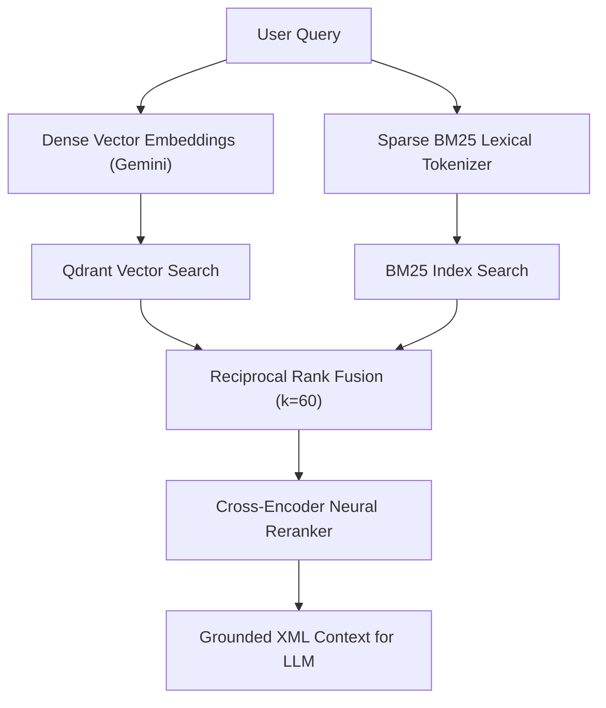
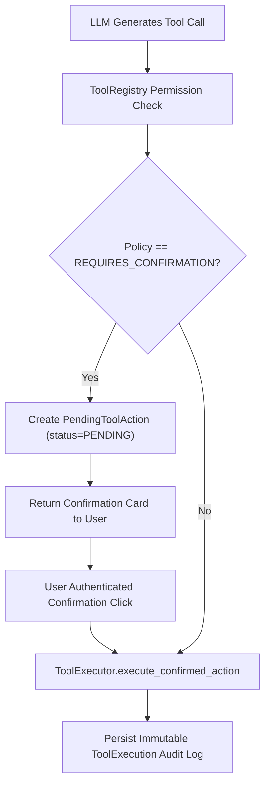

# 08 — Technical Interview Preparation

This document serves as your master technical study guide for AI Engineering and Full-Stack Engineering interviews. Each major topic is structured using an in-depth 12-point format, complete with spoken scripts, architecture diagrams, code references, design trade-offs, and interview Q&As.

---

# Topic 1: Multi-Tenant SaaS Architecture & Tenant Isolation

### 1. What is it?
Multi-tenancy is an architectural pattern where a single instance of the application and database serves multiple customer organizations (tenants), while strictly isolating each tenant's data, users, and AI assets so that no tenant can ever view or mutate another tenant's data.

### 2. Why does Avtaar need it?
Avtaar is an enterprise B2B platform. Different companies upload proprietary internal documents, configure customer-facing AI agents, and run private business tools. Any data leak between companies would represent a catastrophic security and compliance breach.

### 3. How does it work?
1. Incoming requests present a signed JWT in the `Authorization: Bearer <token>` header.
2. The `get_current_tenant` FastAPI dependency decodes the token, verifies the user's active membership, and builds a `TenantContext(company_id, user_id, role)`.
3. Every repository query filters explicitly with `company_id`.
4. Qdrant vector queries enforce a boolean payload match on `company_id`.
5. Redis rate-limiting and in-memory BM25 caches prefix keys with the tenant's `company_id`.

### 4. Architecture and Data Flow

### 5. Important Technical Concepts
- **Row-Level Partitioning:** Storing tenant data in shared tables with indexed tenant foreign keys.
- **Dependency Injection:** FastAPI `Depends(get_current_tenant)` creating an immutable context object for downstream handlers.
- **Fail-Safe Authorization:** If a user requests an ID belonging to a different tenant, the scoped query yields `None`, returning `404 Not Found` without revealing the entity's existence.

### 6. Actual Implementation References
- **Dependency:** [`backend/app/api/deps.py:get_current_tenant`](file:///d:/c%20drive/OneDrive/Desktop/Avtaar/backend/app/api/deps.py)
- **Repositories:** [`backend/app/repositories/document.py`](file:///d:/c%20drive/OneDrive/Desktop/Avtaar/backend/app/repositories/document.py), [`ai_employee.py`](file:///d:/c%20drive/OneDrive/Desktop/Avtaar/backend/app/repositories/ai_employee.py)
- **Vector Filter:** [`backend/app/services/retrieval/dense.py:DenseRetriever.search`](file:///d:/c%20drive/OneDrive/Desktop/Avtaar/backend/app/services/retrieval/dense.py)

### 7. Design Decisions & Alternatives
- **Chosen:** Shared database with row-level tenant key partitioning.
- **Alternative Considered:** Separate database per tenant.
- **Rationale:** Shared database enables cost-effective resource utilization and streamlined schema migrations for hundreds of tenants, while row-level enforcement in the repository layer provides robust logical isolation.

### 8. Limitations and Trade-offs
- If a developer accidentally writes a raw SQL query omitting `company_id`, isolation could be breached. To mitigate this, all queries route through centralized repository classes covered by automated tenant-isolation test suites (`test_tenant_isolation.py`).

### 9. Natural Spoken Interview Explanation
> *"In Avtaar, tenant isolation is enforced as a foundational invariant across every layer of the stack. We use JWT-based authentication where each request resolves into an immutable `TenantContext` containing the verified `company_id`. From there, every database query in our repository layer explicitly filters on `company_id`. In our vector database, Qdrant, we enforce a mandatory payload filter so vector similarity search is physically constrained to that company's chunks. Even our in-memory BM25 lexical caches and Redis rate limiter keys are partitioned by tenant. We back this with automated cross-tenant probing tests to ensure that guessing another company's UUID always returns a clean 404."*

### 10. Interview Questions & Answers
- **Basic Q:** *How do you authenticate API requests in Avtaar?*
  - **A:** We use signed HS256 JWT tokens passed via the `Authorization: Bearer` header, validated by FastAPI dependency injection.
- **Intermediate Q:** *How do you prevent Tenant A from accessing Tenant B's vectors in Qdrant?*
  - **A:** Every point in Qdrant contains a `company_id` payload attribute. All search queries apply a strict Qdrant `Filter(must=[FieldCondition(key="company_id", match=MatchValue(value=company_id))])`.
- **Advanced Q:** *What happens if a user passes a valid JWT but tries to access a document ID belonging to another company?*
  - **A:** Our repository methods use compound SQL filters matching both `id == doc_id` AND `company_id == tenant.company_id`. The query returns `None`, raising a `NotFoundException` (404), preventing ID enumeration attacks.

### 11. Challenging Follow-up Questions & Honest Answers
- **Follow-up:** *Why didn't you use PostgreSQL Row-Level Security (RLS)?*
  - **Honest Answer:** *"PostgreSQL RLS is a great defense-in-depth mechanism. In our current architecture, we enforce isolation in the application's repository layer and support both PostgreSQL and SQLite for local development. Adopting Postgres RLS via database session variables (`SET LOCAL app.current_tenant = ...`) is a great next step when moving exclusively to a managed Postgres production cluster."*

### 12. Practical Example
A customer support manager at Company A creates an AI Employee with ID `e1`. An attacker at Company B sends a request `GET /api/v1/ai-employees/e1` using Company B's JWT. The repository executes `SELECT * FROM ai_employees WHERE id = 'e1' AND company_id = 'company_B'`, returns 0 rows, and responds with `404 Not Found`.

---

# Topic 2: Multi-Stage Hybrid RAG Pipeline & Reranking

### 1. What is it?
A hybrid retrieval pipeline that combines dense vector similarity search with sparse lexical keyword search (BM25), merges the candidate lists using Reciprocal Rank Fusion (RRF), and refines the ranking using a neural Cross-Encoder reranker.

### 2. Why does Avtaar need it?
Pure vector search excels at high-level semantic meaning but frequently fails on exact keyword matching (part numbers, technical codes, product names, acronyms). Pure keyword search fails on semantic phrasing. Hybrid search provides the best of both worlds.

### 3. How does it work?
1. The user query is embedded into a dense vector (Gemini 768d) and searched against Qdrant.
2. In parallel, the query is tokenized and scored against the tenant's BM25 index.
3. Both ranked candidate lists are merged using Reciprocal Rank Fusion:
   $$S_{\text{RRF}}(d) = \frac{1}{60 + r_{\text{dense}}(d)} + \frac{1}{60 + r_{\text{sparse}}(d)}$$
4. The top fused candidates are evaluated by a Cross-Encoder reranker which computes full cross-attention between query and chunk, producing the final Top-$K$ grounded context.

### 4. Architecture and Data Flow

### 5. Important Technical Concepts
- **Dense vs Sparse Retrieval:** Cosine similarity in vector embedding space vs term-frequency inverse-document-frequency (TF-IDF / Okapi BM25).
- **Reciprocal Rank Fusion (RRF):** An algorithm for combining multiple ranked lists without needing score normalization.
- **Cross-Encoder Reranking:** Deep bidirectional cross-attention scoring the query and document together, offering significantly higher precision than bi-encoder cosine distance.

### 6. Actual Implementation References
- **Orchestrator:** [`backend/app/services/retrieval/__init__.py:RetrievalService`](file:///d:/c%20drive/OneDrive/Desktop/Avtaar/backend/app/services/retrieval/__init__.py)
- **BM25:** [`backend/app/services/retrieval/bm25.py:BM25`](file:///d:/c%20drive/OneDrive/Desktop/Avtaar/backend/app/services/retrieval/bm25.py)
- **Fusion:** [`backend/app/services/retrieval/fusion.py:ReciprocalRankFusion`](file:///d:/c%20drive/OneDrive/Desktop/Avtaar/backend/app/services/retrieval/fusion.py)
- **Reranker:** [`backend/app/services/retrieval/reranker.py:CrossEncoderReranker`](file:///d:/c%20drive/OneDrive/Desktop/Avtaar/backend/app/services/retrieval/reranker.py)

### 7. Design Decisions & Alternatives
- **Chosen:** In-memory BM25 cache combined with Qdrant vectors + RRF + Cross-Encoder.
- **Alternative:** Qdrant sparse vectors (SPLADE) or Elasticsearch.
- **Rationale:** Pure Python BM25 with tenant caching provides zero additional infrastructure overhead during initial deployment while achieving high lexical recall.

### 8. Limitations and Trade-offs
- Cross-Encoder neural reranking adds 50–150ms of CPU latency. To optimize this, we rerank only the top 10–20 candidates rather than the entire corpus, and provide a fast heuristic reranker fallback.

### 9. Natural Spoken Interview Explanation
> *"In Avtaar, we designed a hybrid RAG pipeline because standard vector search often fails on domain-specific queries like exact part numbers or error codes. When a query arrives, we execute dense vector search in Qdrant and sparse lexical search in our BM25 index in parallel. We then fuse these candidate rankings using Reciprocal Rank Fusion with a smoothing constant of $k=60$. Finally, the top fused candidates pass through a Cross-Encoder reranker that scores bidirectional cross-attention between the query and chunk. This ensures high semantic recall from dense search, high precision from BM25, and optimal ranking from the reranker."*

### 10. Interview Questions & Answers
- **Basic Q:** *Why use hybrid search over simple vector search?*
  - **A:** Vector embeddings compress sentences into dense points, which sometimes smooths out exact keyword matches like SKUs or acronyms. Hybrid search preserves exact keyword matching while retaining semantic understanding.
- **Intermediate Q:** *How does Reciprocal Rank Fusion work?*
  - **A:** RRF assigns each document a score equal to the reciprocal of its rank position plus a constant ($k=60$) across all rankers. This allows fusing lists with completely different scoring scales without normalization issues.
- **Advanced Q:** *What is the difference between a Bi-Encoder and a Cross-Encoder?*
  - **A:** A Bi-Encoder embeds queries and documents separately into vectors and compares them using cosine similarity (fast, suitable for initial retrieval). A Cross-Encoder feeds the query and document together into the transformer to compute full cross-attention (slower, but much higher precision, ideal for reranking top-$K$).

### 11. Challenging Follow-up Questions & Honest Answers
- **Follow-up:** *How do you invalidate the in-memory BM25 index when a document is updated?*
  - **Honest Answer:** *"We maintain a `global_bm25_cache` that stores indexes keyed by `(company_id, kb_id)`. When a document is ingested, updated, or deleted, `IngestionService` triggers `global_bm25_cache.invalidate_tenant(company_id)`, forcing the next query to lazily rebuild the BM25 index from database chunk records."*

### 12. Practical Example
A user searches: `"What is error code ERR-904 in the v2 firmware?"`. Dense vector search might return general firmware documents. BM25 directly scores the exact token `"ERR-904"`. RRF merges both, placing the exact error troubleshooting chunk at rank 1.

---

# Topic 3: Agent Tool Calling & Human-in-the-Loop Confirmation

### 1. What is it?
A controlled agentic execution framework where an AI Employee can select and execute business tools (e.g. database lookups, lead creation, support tickets), with dangerous state-mutating actions requiring explicit human confirmation before execution.

### 2. Why does Avtaar need it?
Autonomous LLMs cannot be trusted to execute irreversible write operations (e.g. charging a customer, deleting records, filing tickets) without safeguards. Avtaar enforces a deterministic security boundary between conversational reasoning and tool execution.

### 3. How it Works
1. Tools are registered with JSON schemas and policy markers (`READ_ONLY` vs `REQUIRES_CONFIRMATION`).
2. When the LLM calls a tool requiring confirmation, `ToolExecutor` writes a `PendingToolAction` to the DB and returns a structured confirmation card payload.
3. The conversation halts and prompts the user in the UI.
4. When the user clicks "Confirm", the frontend calls `/api/v1/tools/confirm/{id}`.
5. The backend validates tenant ownership, verifies status is `PENDING`, executes the action, updates status to `CONFIRMED`, and logs an immutable `ToolExecution` audit record.

### 4. Architecture and Data Flow

### 5. Important Technical Concepts
- **Deterministic Tool Validation:** Validating tool arguments against Pydantic models before execution.
- **Idempotency & State Machines:** `PendingToolAction` lifecycle (`PENDING` ➔ `CONFIRMED` / `REJECTED` / `EXPIRED`).
- **Bounded ReAct Loop:** Maximum iteration limits preventing infinite recursion.

### 6. Implementation References
- **Executor:** [`backend/app/services/agent/tool_executor.py:ToolExecutor`](file:///d:/c%20drive/OneDrive/Desktop/Avtaar/backend/app/services/agent/tool_executor.py)
- **Orchestrator:** [`backend/app/services/agent/orchestrator.py:AgentOrchestrator`](file:///d:/c%20drive/OneDrive/Desktop/Avtaar/backend/app/services/agent/orchestrator.py)
- **Models:** [`backend/app/models/pending_tool_action.py:PendingToolAction`](file:///d:/c%20drive/OneDrive/Desktop/Avtaar/backend/app/models/pending_tool_action.py)

### 7. Natural Spoken Interview Explanation
> *"In Avtaar, we treat tool execution as a strict security boundary. Tools are categorized as either read-only or state-mutating. Read-only tools like `order_lookup` execute immediately within our bounded agent loop. But for state-mutating tools like `create_support_ticket`, the execution pauses, creates a database-backed `PendingToolAction`, and returns an interactive confirmation payload. The write only executes after the user clicks confirm, which triggers an authenticated endpoint that verifies tenant ownership and logs an immutable audit trail."*
